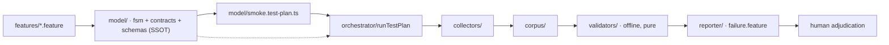

# Reactive Testing — Spec-First Testware

> Describe the app **once** as a formal model (FSM + contracts + schemas). A
> deterministic orchestrator records **evidence** (a corpus) from a live
> session. Pure validators verify that evidence **offline** — no browser needed
> — and failures surface as reviewable Gherkin for a human to adjudicate.
> One navigation funds N validations. **The model is the source of truth**;
> every test script, plan, and corpus is a derived byproduct.

Reactive Testing is a working method for the AI-assisted age: as AI writes more
code, the human's enduring job is deciding *what is true* — and the model is
where that decision lives. This repository is a TypeScript proof of it against
the **Kraken Pro** trading UI (read-only flows: home page, portfolio, history).



Two phases, deliberately separated (see [docs/architecture.md](docs/architecture.md)):

1. **Authoring** (offline, AI-assisted, human-reviewed): Gherkin features in
   `features/` are distilled into the executable model in `model/` — the SSOT —
   from which a named **test plan** is generated.
2. **Execution & verification**: the orchestrator runs the plan against the live
   app via CDP, collectors write raw evidence into `corpus/`, then **pure
   validators** re-check that evidence offline. A failure surfaces as reviewable
   Gherkin; a human adjudicates *spec drift* vs *app bug*.

## Quick start

Prerequisites: **Node ≥ 24**, Playwright browsers installed
(`npx playwright install chromium`), and for live recording an **authenticated
Chromium** started with a debugging port:

```bash
chromium --remote-debugging-port=9222 --user-data-dir=/tmp/kraken-profile
# log in to https://pro.kraken.com in that window (2FA etc.), leave it open
```

```bash
npm ci          # install dependencies
npm run typecheck   # tsc --noEmit — the type-safety gate
npm test            # vitest run — 17 files / ~209 tests (all offline, no browser)
npm run run:smoke   # record a fresh corpus from your live browser (see docs/usage.md)
```

`npm run run:smoke` attaches to your browser over CDP, drives the smoke plan
(10 scenarios across the home-page nav + portfolio-summary dialog), and writes
recorded evidence under `corpus/`. Your browser is **never closed**.

## Parts of the project

| Part | What it is |
|------|-----------|
| `model/` | The executable source of truth: FSM, contracts, Zod schemas, model-version hash, the generated smoke test plan |
| `features/` | Authored Gherkin input (`@plan:smoke`) |
| `orchestrator/` | The deterministic runner, CDP attach, action map, corpus writer |
| `collectors/` | Page collectors: snapshot · probe · network · screenshot |
| `validators/` | Pure offline validation: per-contract interpreter, corpus loader, offline runner, cross-view invariants |
| `reporter/` | Renderers: failing checks as reviewable Gherkin, adjudication records |
| `repro/` | Standalone repro-script generator (a bug path → a runnable script) |
| `bin/` | `run-smoke.ts` — the only CLI entry point today |
| `corpus/` | Recorded evidence (gitignored) |

The full per-directory map, with real file names and corpus layout, lives in
[docs/project-map.md](docs/project-map.md).

## Documentation

- [docs/architecture.md](docs/architecture.md) — how the system is built: two phases, the model as SSOT, the players, and the diagrams (FSM state diagram, pipeline, sequence).
- [docs/usage.md](docs/usage.md) — the daily workflow: record a corpus, inspect it, re-validate offline, render failures, adjudicate, and generate repro scripts.
- [docs/project-map.md](docs/project-map.md) — every part of the tree and the corpus file layout.
