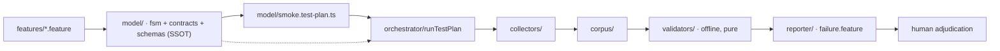

# Reactive Testing — Spec-First Testware

> Describe the app **once** as a formal model (FSM + contracts + schemas). A
> deterministic orchestrator records **evidence** (a corpus) from a live
> session. Pure validators verify that evidence **offline** — no browser needed
> — and failures surface as reviewable Gherkin for a human to adjudicate.
> One navigation funds N validations. **The model is the source of truth**;
> every test script, plan, and corpus is a derived byproduct.

Reactive Testing is a working method for the AI-assisted age: as AI writes more
code, the human's enduring job is deciding *what is true* — and the model is
where that decision lives. This repository is a TypeScript proof of it against
the **Kraken Pro** trading UI (read-only flows: home page, portfolio, history).



Two phases, deliberately separated (see [docs/architecture.md](docs/architecture.md)):

1. **Authoring** (offline, AI-assisted, human-reviewed): Gherkin features in
   `features/` are distilled into the executable model in `model/` — the SSOT —
   from which a named **test plan** is generated.
2. **Execution & verification**: the orchestrator runs the plan against the live
   app via CDP, collectors write raw evidence into `corpus/`, then **pure
   validators** re-check that evidence offline. A failure surfaces as reviewable
   Gherkin; a human adjudicates *spec drift* vs *app bug*.

## Quick start

Prerequisites: **Node ≥ 24**, Playwright browsers installed
(`npx playwright install chromium`), and for live recording an **authenticated
Chromium** started with a debugging port:

```bash
chromium --remote-debugging-port=9222 --user-data-dir=/tmp/kraken-profile
# log in to https://pro.kraken.com in that window (2FA etc.), leave it open
```

```bash
npm ci          # install dependencies
npm run typecheck   # tsc --noEmit — the type-safety gate
npm test            # vitest run — 17 files / ~209 tests (all offline, no browser)
npm run run:smoke   # record a fresh corpus from your live browser (see docs/usage.md)
```

`npm run run:smoke` attaches to your browser over CDP, drives the smoke plan
(10 scenarios across the home-page nav + portfolio-summary dialog), and writes
recorded evidence under `corpus/`. Your browser is **never closed**.

## Parts of the project

| Part | What it is |
|------|-----------|
| `model/` | The executable source of truth: FSM, contracts, Zod schemas, model-version hash, the generated smoke test plan |
| `features/` | Authored Gherkin input (`@plan:smoke`) |
| `orchestrator/` | The deterministic runner, CDP attach, action map, corpus writer |
| `collectors/` | Page collectors: snapshot · probe · network · screenshot |
| `validators/` | Pure offline validation: per-contract interpreter, corpus loader, offline runner, cross-view invariants |
| `reporter/` | Renderers: failing checks as reviewable Gherkin, adjudication records |
| `repro/` | Standalone repro-script generator (a bug path → a runnable script) |
| `bin/` | `run-smoke.ts` — the only CLI entry point today |
| `corpus/` | Recorded evidence (gitignored) |

The full per-directory map, with real file names and corpus layout, lives in
[docs/project-map.md](docs/project-map.md).

## Documentation

- [docs/architecture.md](docs/architecture.md) — how the system is built: two phases, the model as SSOT, the players, and the diagrams (FSM state diagram, pipeline, sequence).
- [docs/usage.md](docs/usage.md) — the daily workflow: record a corpus, inspect it, re-validate offline, render failures, adjudicate, and generate repro scripts.
- [docs/project-map.md](docs/project-map.md) — every part of the tree and the corpus file layout.
- [docs/troubleshooting.md](docs/troubleshooting.md) — common errors and how to fix them.
- [docs/authoring-example.md](docs/authoring-example.md) — walk through adding a new screen.

## Roadmap

All 21 stories across the four epics are complete and each epic's retrospective
is recorded. The project works end-to-end on the Kraken Pro home-page critical
path. What comes next is grouped by horizon.

### Now — ready to pick up

These are the highest-value, lowest-dependency items tracked in the
[sprint status](_bmad-output/implementation-artifacts/sprint-status.yaml)
and [deferred work](_bmad-output/implementation-artifacts/deferred-work.md).

- **Wire cross-view invariants into the runner.** `runCrossViewInvariants` exists
  but no runner calls it. The seed `portfolio-value` probe needs wiring too.
- **Resolve earn-nav intermittent timeout.** Scenario 7
  (`clicking-earn-navigates-to-the-standalone-earn-page`) occasionally times
  out and cascades to fail the dialog scenarios that follow.
- **Add path-continuity validation to `repro-generator`.** The generator checks
  each step individually but does not enforce that step _N_+1 starts where
  step _N_ ends.
- **Add timeout discipline to emitted repro scripts.** The orchestrator wraps
  steps in `STEP_TIMEOUT_MS`; emitted scripts do not.
- **Harden cross-view boundary (normalize, empty evidence, tie test).**
- **Add an automated emitted-repro verification gate** (generate → `tsc --noEmit`).

### Short-term

- **Author three feature files into the model.** `home-page-portfolio-value.feature`,
  `home-page-invariants.feature`, and `home-page-layout-menu.feature` exist but
  are not exercised by any plan.
- **Add History/Main/Ledger contracts.** Filter-by-type, paginate, clear-filters
  — the Kraken Pro History page is the deepest modelled surface.
- **Add layout menu state and contract** (open retro item from Epic 1).
- **Extract a shared plan-step iteration helper** (retro item F3, Epic 3).
- **Add a CLI path for verification and reporting.** Currently library-only;
  running validators means writing a small `tsx` script.
- **Dialog predicate evaluators.** `dialog-open` and `dialog-closed` are
  declared but not yet evaluatable.

### Future

- **Headless smoke mode.** Currently recording always attaches to the human's
  authenticated browser over CDP.
- **State loading and anchoring.** Open design question: how does testware load
  or anchor persistent app state (portfolio value, ledger entries, balances)
  before running scenarios that reference it?
- **Graph / CAP-4 features.** Proposed-edge queries and standing reachability
  invariants (deferred to v1.1).
- **xunit / CI output reporters.** Current reporters write Gherkin + JSON into
  the corpus folder; no CI-format output exists.
- **Full Kraken Pro model.** Beyond the home page critical path: order book,
  trading, settings, and non-read-only flows.
- **Network capture orchestrator wiring.** The two-phase network collector
  handle (`startNetworkCapture`/`finish`) is shipped at the collector level;
  the orchestrator does not wire it yet.
- **Path-traversal hardening on corpus writes.** Deferred until external
  callers exist (current call sites are internal and hardcoded).

## Contributing

### AI-Assisted Development

This project uses the **BMad** method — AI agents drive stories from spec
through implementation to review. All four epics were built this way; see the
full agent operating rules in [AGENTS.md](AGENTS.md).

The model is the single source of truth. Every test script, plan, and corpus is
a derived byproduct — the human's enduring job is deciding *what is true*, and
a BMad agent implements that decision.

### Workflow

1. **Write a Gherkin feature** in `features/` capturing the new behaviour
   (business intent, not implementation).
2. **Distil into the model** — add states to `model/fsm.ts`, contracts to
   `model/contracts.ts`, and any new shared shapes to `model/schemas.ts`.
3. **Implement actions** — add Playwright locators to `orchestrator/action-map.ts`.
4. **Cut a story** in `_bmad-output/implementation-artifacts/` (see the existing
   specs as templates).
5. **Run `bmad-build`** to drive implementation, tests, and review.
6. **Land via PR** on a `feat/story-<N>-<slug>` branch, single rebased commit,
   merge to `main`.

For a complete walkthrough with a concrete example, see
[docs/authoring-example.md](docs/authoring-example.md).

### Branch Policy

- **Never** commit a story directly to `main`.
- Each story is developed on `feat/story-<N>-<slug>`, locally rebased into a
  single commit, then merged to `main` via a PR.
- This is a working rule — not enforced by CI or branch protection.

### Getting Started

- Explore the backlog: [`deferred-work.md`](_bmad-output/implementation-artifacts/deferred-work.md)
- Pick an open action item from [`sprint-status.yaml`](_bmad-output/implementation-artifacts/sprint-status.yaml)
- Learn the authoring workflow in [`docs/authoring-example.md`](docs/authoring-example.md)
- Read the agent operating rules in [`AGENTS.md`](AGENTS.md)
