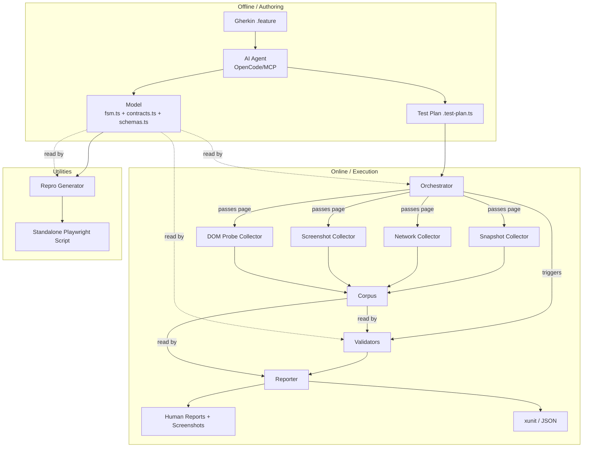
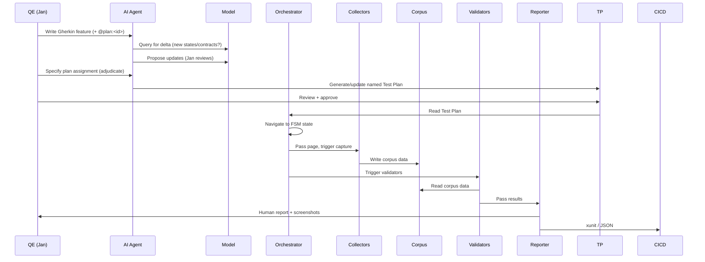

# Architecture Spine — Reactive Testing

## Design Paradigm

**Pipeline with Model-as-SSOT.** The system is a linear dataflow with the Model at the center:

```
Gherkin (input) → Model (SSOT) → Test Plans (named, generated) → Orchestrator → Collectors → Corpus → Validators → Reporter
```

The Model is the single source of truth — everything else reads from it or writes to it. The pipeline has two phases:
1. **Offline / authoring**: Gherkin → AI Agent → Model + named Test Plans (deterministic files)
2. **Online / execution**: Test Plan → Orchestrator → Collectors → Corpus → Validators → Reporter (no AI in the loop)

Each player owns one concern. Players communicate through typed interfaces (TypeScript), not through shared mutable state.

## Invariants & Rules

### AD-1 — Model is the SSOT

- **Binds:** CAP-1, CAP-2, CAP-3, CAP-4, CAP-5, all players
- **Prevents:** truth living in Gherkin, test code, or corpus data instead of the Model
- **Rule:** The Model (fsm.ts + contracts.ts + schemas.ts) is the single source of truth for application behavior. Gherkin is an input interface. Test plans are derived artifacts. Corpus is runtime evidence. Every player must treat the Model as the sole authority.

### AD-2 — Corpus is runtime evidence, not truth

- **Binds:** CAP-2, Collector, Validator, Reporter
- **Prevents:** conflating what the app IS (Model) with what it DID (Corpus)
- **Rule:** The Corpus holds snapshots, network events, DOM probes, and screenshots captured during scenario execution. It is evidence collected against the Model, never a source of truth. Validators read the Corpus; they never write to the Model.

### AD-3 — Validators are per-contract pure functions

- **Binds:** CAP-2, CAP-3, Validator
- **Prevents:** mixing app definition with test verification; embedding validation in the Orchestrator or Collectors
- **Rule:** A Validator is a pure function: corpus data in → pass/fail out. Validators are per-contract for MVP. Cross-state invariants and other validation types emerge from implementation. Validators declare what corpus data they need (AD-6).

### AD-4 — Orchestrator is offline and deterministic

- **Binds:** CAP-2, Orchestrator, Collector, Validator
- **Prevents:** non-deterministic AI-driven test execution; runtime intelligence in the execution loop
- **Rule:** The Orchestrator reads a Test Plan (TypeScript file) and executes it deterministically. No AI calls during execution. The Test Plan declares: path (FSM states), collection (what data), validators (what to run). The Orchestrator drives the browser via Playwright/CDP, passes the page to Collectors, and triggers Validators.

### AD-5 — Collectors are specialized and page-driven

- **Binds:** CAP-2, Collector, Orchestrator
- **Prevents:** monolithic collector; Collectors owning browser connections; wasted data collection
- **Rule:** Multiple specialized Collectors (SnapshotCollector, NetworkCollector, ScreenshotCollector, etc.). The Orchestrator passes the page object to the Collector; the Collector captures data (page in → corpus data out). MVP scope: snapshots, network events, DOM probes, screenshots.

### AD-6 — Validator declares corpus dependencies

- **Binds:** CAP-2, Validator, Orchestrator
- **Prevents:** unnecessary data collection; missing required data for validation
- **Rule:** Each Validator declares what corpus data it needs. The Orchestrator reads these declarations to plan which Collectors to run. This is the contract between Validators and the Orchestrator.

### AD-7 — Repro Generator emits standalone scripts

- **Binds:** CAP-5, Repro Generator
- **Prevents:** developers having to manually reconstruct bug reproduction steps; framework-coupled repro scripts
- **Rule:** The Repro Generator reads the Model (FSM states + transitions) and emits a standalone Playwright script. Input: bug path (FSM states to visit). Output: simple, readable script for manual developer validation — no validations, no framework dependency.

### AD-8 — Reporter is separate from Orchestrator

- **Binds:** CAP-2, CAP-3, Reporter
- **Prevents:** coupling orchestration logic with output formatting; inability to change report formats independently
- **Rule:** The Reporter reads the Corpus (including screenshots) and produces human-readable reports (with screenshots attached) and CI/CD formats (xunit XML, JSON). It is a separate player from the Orchestrator — different reason to change.

### AD-9 — Gherkin Interface is a file convention, not a processing layer

- **Binds:** CAP-1, CAP-3, Gherkin Interface, AI Agent
- **Prevents:** unnecessary middleware between human input and AI interpretation; Gherkin becoming the SSOT
- **Rule:** Gherkin features are `.feature` files in the repo. No parser, no processing layer. The AI Agent reads Gherkin directly and translates into Model updates + Test Plans. Primary role: input (QE describes use cases). Secondary role: output (failing tests surface as Gherkin for review).

### AD-10 — AI Agent proposes, human reviews

- **Binds:** CAP-1, AI Agent, Model
- **Prevents:** unreviewed AI changes to the Model; silent spec edits
- **Rule:** The AI Agent (OpenCode/MCP) reads Gherkin, queries the Model for deltas, proposes Model updates, and generates Test Plans. All changes are reviewed by a human before merging. No silent edits.

### AD-11 — Graph queries deferred to v1.1

- **Binds:** CAP-4, FR-10, FR-11
- **Prevents:** building graph query infrastructure before the Model exists; scope creep in MVP
- **Rule:** FR-10 (propose missing edges) and FR-11 (reachability invariant) are deferred to v1.1. The PRD §6.1 lists them as In Scope; the spine defers them. PRD/SPEC need updating to match. Graph queries depend on a mature Model and are a natural MBT application — revisit when the Model is queryable.

### AD-12 — Dedup for Model updates

- **Binds:** CAP-1, AI Agent, Model
- **Prevents:** duplicate states/contracts accumulating in the Model from human Gherkin input
- **Rule:** The AI Agent checks for duplicates when proposing Model updates. Programmatic delta query is deferred (RFE). For now, dedup happens in conversation during the authoring phase. Before proposing, the Agent must query the committed fsm.ts and contracts.ts (not conversation history).

### AD-13 — Corpus data shape is defined by schemas.ts

- **Binds:** CAP-2, Collector, Validator, Reporter
- **Prevents:** Collectors and Validators independently evolving incompatible data interfaces
- **Rule:** schemas.ts is the single home for every shared shape type: the canonical corpus data types (SnapshotRecord, NetworkEvent, ProbeResult, ScreenshotRef, ValidationResult) **and** the plan/artifact types (`PlanId`, `TestPlan`). Every Collector must produce data conforming to the corpus types. Every Validator's declared corpus dependency (AD-6) must reference the corpus types. No player may introduce a shared data shape outside schemas.ts.

### AD-14 — Validator returns typed results

- **Binds:** CAP-2, CAP-3, Validator, Reporter
- **Prevents:** mixed return types across validators; Reporter unable to consume results
- **Rule:** Every Validator must return a result conforming to ValidationResult in schemas.ts: { contractId: string, passed: boolean, details?: string, corpusRefs: string[] }. The Reporter consumes only this type. No Validator may return a custom shape.

### AD-15 — Corpus files are namespaced by run

- **Binds:** CAP-2, Collector, Orchestrator
- **Prevents:** multiple scenario runs overwriting each other's evidence; validators unable to locate correct corpus
- **Rule:** Each scenario run writes a run-manifest.json (run-id, timestamp, file list). Corpus files follow: `collectorType/run-id/stepIndex.ext`. The Orchestrator assigns run-id (UUID) and stepIndex; Collectors never choose filenames.

### AD-16 — Collector errors are isolated

- **Binds:** CAP-2, Collector, Orchestrator
- **Prevents:** single collector failure aborting entire scenario run
- **Rule:** Each Collector runs in a try/catch. On failure, partial corpus is written, remaining Collectors still invoked. The Reporter flags collection gaps in the output.

### AD-17 — Test Plan must reference Model version

- **Binds:** CAP-2, Orchestrator, AI Agent
- **Prevents:** deterministic execution against stale truth
- **Rule:** Every generated Test Plan must embed the Model version it was derived from — a content hash (SHA-256) of the three committed model files (`fsm.ts`, `contracts.ts`, `schemas.ts`); one deterministic scheme, no alternatives. The Orchestrator must verify this matches the current Model before execution; on mismatch, abort with a clear error.

### AD-18 — State-reuse is an architectural invariant

- **Binds:** CAP-2, Validator, Orchestrator
- **Prevents:** navigation cost multiplication as validators are added
- **Rule:** One navigation funds N Validators. New validators must not multiply navigation cost. If a validator needs data from a state no existing path reaches, the validator is flagged as blocked until the FSM grows a reachable path.

### AD-19 — Test plans are named and QE-assigned

- **Binds:** CAP-1, CAP-2, CAP-3, AI Agent, Orchestrator
- **Prevents:** a single anonymous test plan; the agent silently choosing where a scenario runs; a scenario's plan assignment drifting out of sync with the model
- **Rule:** Test plans are named, plural artifacts drawn from a fixed traditional taxonomy — `smoke` (minimal critical path), `regression` (full functional coverage), `acceptance` (end-to-end user journeys) — each a `*.test-plan.ts` file (e.g. `smoke.test-plan.ts`). The plan file is the single source of truth for plan membership; the AI Agent is its sole writer (offline authoring, per AD-4/AD-10). `PlanId` in schemas.ts is the closed union `"smoke" | "regression" | "acceptance"`. Each plan declares `planId`, `modelVersion` (per AD-17), and the scenario ids it covers; per scenario it also carries the path / collection / validators AD-4 requires. A scenario carries one QE-specified assignment as a `@plan:<id>` tag in its `.feature` — an input directive only (read by the AI Agent; there is no parser, per AD-9), never the membership record. The AI Agent is the sole reader/validator of the tag: it rejects a tag outside the `PlanId` union, a missing tag, or multiple tags at authoring time (a behavior contract, per AD-9's no-parser rule). The AI routes the scenario into the QE-specified plan and proposes (never silently chooses) the assignment when none is given. "Membership regenerable from assignments" is a verification check (plan membership == the set of scenario tags), never a second write path.

## Consistency Conventions

| Concern | Convention |
|---|---|
| Language | TypeScript only — Model, Test Plans, Validators, Repro scripts. No YAML, no other languages. |
| Schema library | Zod for all schema definitions, data validation, and type inference. schemas.ts exports Zod schemas; TypeScript types are inferred from them (`z.infer<typeof schema>`). |
| File separation | One format per file. Model in TS (fsm.ts, contracts.ts, schemas.ts). Runtime data (snapshots, network events, probes, screenshots) in separate plain-data files, never embedded in TS. |
| Naming (entities) | FSM states: camelCase strings matching screen/dialog names (e.g., `orderBook`, `portfolio`). Contracts: camelCase verb phrases (e.g., `placeLimitBuy`). Validators: `validate-` prefix (e.g., `validate-order-book`). Scenarios: deterministic kebab-case slug `<feature-filename>-<scenario-slug>` (e.g. `history-filters-filter-by-type`), minted once and stable across plan regenerations. |
| Naming (files) | Model: `fsm.ts`, `contracts.ts`, `schemas.ts`. Test plans: `*.test-plan.ts` — one file per plan (`smoke`, `regression`, `acceptance`), each declaring `planId` + `modelVersion`. Validators: `validate-*.ts`. Collectors: `collect-*.ts`. Reports: output directory, not checked in. |
| Gherkin files | `.feature` extension, Gherkin syntax, stored in `features/` directory. |
| Scope gate | v1 = read-only flows only (order History, order book, portfolio). No order execution, no mutating contracts. Seed model = read-only critical path: order History, order book, portfolio views. Grown incrementally via discover-and-record; whole-FSM capture never required. |
| English strictly | All corpus vocabulary, generated artifacts, and code comments in English. Use "Validator" (or "shared validator"), never "aspect." |
| Type-safety gate | `tsc --noEmit` clean is a precondition for any generated code. Types are the contract. |

## Stack

| Name | Version |
|---|---|
| TypeScript | 5.9.3 |
| Node.js | 24.19.0 |
| Playwright | 1.62.1 |
| Zod | ^4 — schema validation and data modeling |
| Playwright MCP | not pinned — AI Agent connection |
| OpenCode/MCP | not pinned — AI Agent |
| CDP | Chrome DevTools Protocol (via Playwright) |

## Structural Seed

```text
reactive-testing/
  model/
    fsm.ts              # FSM: states, transitions, guards, initial state
    contracts.ts        # Dialog contracts: preconditions, actions, postconditions, invariants
    schemas.ts          # TypeScript types and schemas for the corpus
  features/
    *.feature           # Gherkin input files
  test-plans/
    *.test-plan.ts      # Named deterministic test plans (smoke | regression | acceptance)
  validators/
    validate-*.ts       # Pure validation functions (corpus → pass/fail)
  collectors/
    collect-snapshot.ts
    collect-network.ts
    collect-screenshot.ts
    collect-probe.ts    # DOM probes (targeted value extraction)
  corpus/
    snapshots/          # Plain-data snapshot files
    network/            # Network event logs
    screenshots/        # PNG screenshots
    probes/             # DOM probe results
  reports/
    *.xml               # xunit output
    *.json              # Machine-readable results
  scripts/
    repro-*.ts          # Generated standalone repro scripts
```

### System Diagram



### Data Flow



## Capability → Architecture Map

| Capability                        | Lives in                                          | Governed by                        |
|-----------------------------------|---------------------------------------------------|------------------------------------|
| CAP-1 — Discover and Record       | AI Agent + Model + Gherkin Interface              | AD-1, AD-9, AD-10, AD-12, AD-19    |
| CAP-2 — Three-Concern Test        | Orchestrator + Collectors + Validators + Reporter | AD-2, AD-3, AD-4, AD-5, AD-6, AD-8, AD-19 |
| CAP-3 — Gherkin Governance        | Gherkin Interface + AI Agent + Model              | AD-1, AD-9, AD-10, AD-19           |
| CAP-4 — Graph as Product Artifact | (deferred — Graph Query Engine)                   | AD-11                              |
| CAP-5 — Repro Script Generation   | Repro Generator + Model                           | AD-7                               |

## Deferred

| Item                                                              | Reason it can wait                                               |
|-------------------------------------------------------------------|------------------------------------------------------------------|
| Graph Query Engine (proposed edges, reachability, cognitive load) | Model must exist first; nice-to-have, not MVP                    |
| Programmatic delta query (dedup)                                  | Human-in-the-loop dedup works for MVP; programmatic query is RFE |
| Cross-Surface Consistency (CAP-6 vs under CAP-2)                  | RESOLVED — nested under CAP-2, in v1 scope (FR-13)               |
| FR-11 operationalization (important states, comparable cost)      | Pin against seed model's critical path at planning               |
| Model↔app synchronization (drift detection)                       | Open question — needs real usage to understand                   |
| CI/CD integration shape                                           | Design deferred to planning                                      |
| Order-execution automation (mutating contracts)                   | v2 scope — small real-money DCA buys                             |
| Prose design doc                                                  | Deferred to later sprint                                         |
| Mobile/Appium abstraction (TestDriver protocol)                   | v2 scope — desktop web only                                      |
