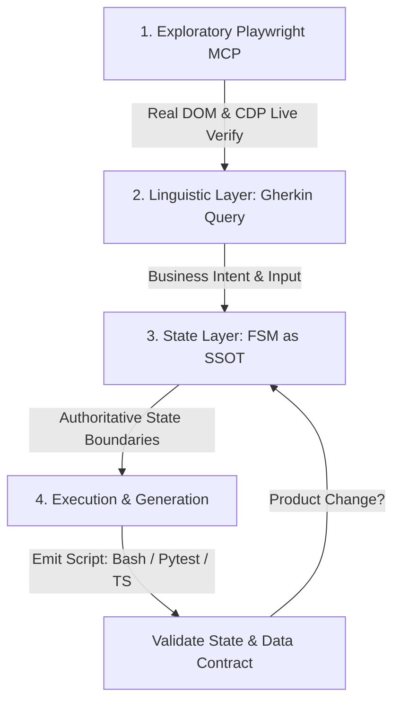

# Reactive Testing — Constitution

## Core Principles

1. **Data over ceremony.** States, contracts, validations are plain Clojure maps. No frameworks, no annotations, no magic.
2. **Observe first, validate later.** Scénář jen sbírá snapshoty — validace běží offline nad neměnnými daty.
3. **One navigation, N validations.** State reuse je hlavní hodnota. Navigace do stavu stojí čas — validace nad snapshotem nestojí nic.
4. **Explicit chain over implicit aspects.** Validátory jsou normální funkce v normálním vektoru. Žádné bytecode weaving, žádné proxy, žádné anotace. Zavoláš je — vidíš je v stack trace.
5. **Spec-first, spec as data.** Kontrakt = Clojure mapa. Postconditions = Malli schema. Typy = spec. Všechno je datová struktura, všechno jde serializovat.
6. **Schema ≠ Data.** Specifikace popisuje **tvar** (schema) a **pravidla** (vlastnosti) dat — nikdy konkrétní hodnoty. Data vznikají až v běhu jako snapshot. Validace = data ⊨ schema + vlastnosti.
7. **Intent-First & Language Agnostic.** Testware není kód — je to formální, platformově nezávislá specifikace chování systému. Implementace (TypeScript, Python/Pytest, Clojure, nebo prostý Bash skript) je jen mechanický detail provedení.
8. **Gherkin as Interface, Not SSOT.** Gherkin soubory nejsou Single Source of Truth. Slouží výhradně jako vstupní formát nebo dotazovací jazyk nad podkladovým SSOT (FSM a datové kontrakty).

## The Universal Scenario Lifecycle

Každá nová validace feature, regresní test nebo oprava bugu sleduje čtyřfázový protokol:



1. **Exploratory Playwright MCP** — přímá read-only interakce s živou aplikací přes Playwright MCP/CDP. Cíl: ověřit reálné DOM chování, síťový provoz, elementy a ephemeral stavy (toasty, loadery). Žádné dohady — vše se ověřuje živě.

2. **Linguistic Layer (Gherkin jako dotaz/vstup)** — vyjádřit business záměr Gherkin scénářem (`features/*.feature`) jako vstup či dotaz adresující jádrové SSOT struktury. Cíl: lidsky čitelný vstup a dotazovací rozhraní, aniž by se Gherkin vydával za skutečný zdroj pravdy.

3. **State Layer (FSM jako SSOT)** — vyhodnotit hranice stavů proti `states.edn`. Mění se URL nebo hlavní obsahový panel? → rozšiř FSM registr stavů. Je to jen variace parametru ve stejném stavu? → ber jako datovou variantu. Cíl: autoritativní, přesná mapa stavů nezávislá na textové reprezentaci.

4. **Execution & Generation** — vygenerovat či napsat spouštěcí skript (Bash, Pytest, TS Playwright). Cíl: ověřit, že systém dosáhl očekávaného FSM stavu a splnil datový kontrakt. Když skript selže kvůli změně produktu, aktualizuj specifikaci — ne jen skript.

## AI Agent Protocol — z živé aplikace do Gherkin

Tato sekce popisuje, jak má AI agent (BMAD, goose, nebo jiný MCP klient) systematicky prozkoumat stránku/aplikaci a navrhnout Gherkin scénáře, datové kontrakty a identifikovat stavy. Je to **meta-instrukce** pro agenta — protokol, ne výsledek.

### 1. Připojení a orientace

```
1. Připoj se k prohlížeči (CDP port 9222, nebo přes Playwright MCP)
2. Zjisti, jaké stránky/taby jsou otevřené
3. Pro každou stránku:
   a) Zachyť URL a title
   b) Udělej ariaSnapshot (sémantická struktura) → identifikuj navigační prvky, role
   c) Udělej DOM probe (CSS třídy, canvas prvky, texty) → identifikuj data a skryté elementy
```

### 2. Identifikace stavů (FSM)

Z ariaSnapshotu extrahuj **navigační strukturu:**

```
ARIA signály pro STAV:
  • [role="tab"]       → tab (Main, Futures, Earn)
  • [role="tablist"]   → sada tabů
  • [role="link"]      → navigační odkaz (mění URL)
  • URL změna          → vždy nový stav

ARIA signály pro PARAMETR (není stav):
  • [role="combobox"]  → filtr (Types, Assets)
  • [role="textbox"]   → filtr (Date)
  • [role="button"] na řádku tabulky → akce (otevření detailu)
```

Výstup: seznam stavů (URL + popis) a jejich parametrů.

### 3. Identifikace kontraktů (akcí)

Pro každý interaktivní prvek urči, jakou **akci** spouští:

```
ARIA prvek                     → Kontrakt
────────────────────────────────────────────
tab "Main" [selected]         → switch-tab-main
tab "Futures"                  → switch-tab-futures
combobox "Types"               → filter-by-type
button "Clear filters"         → clear-filters
button s textem "Open ledger"  → open-ledger-detail
button ▶ (pagination)          → paginate-next
link "View statements"         → navigate-statements
```

Pro každý kontrakt zachyť:
- **preconditions**: co musí platit, aby akce šla provést?
- **action**: co přesně agent udělá (klik, fill, select)
- **postconditions**: co se musí změnit? (URL, data, UI stav)

### 4. Identifikace datového schematu

Z tabulek, seznamů a strukturovaných dat extrahuj **schema**:

```clojure
;; Z ariaSnapshotu tabulky:
;;   row "Date Type Wallet Asset Ticker Amount Fee Balance ID"
;;   cell "Withdrawal"  cell "Spot"  cell "Euro"  cell "EUR"
;;   cell "-1,698.93"   cell "1"     cell "0.0008"

;; Agent odvodí:
(def LedgerRow
  [:map
   [:date    :string]
   [:type    [:enum "Deposit" "Withdrawal" "Rewards" ...]]  ;; z hodnot v buňkách
   [:wallet  [:enum "Spot" "Staking" "Earn" "Futures"]]
   [:asset   :string]
   [:ticker  :string]
   [:amount  :string]     ;; formát "-1,698.93 EUR"
   [:fee     :string]
   [:balance :string]
   [:id      :string]])
```

**Pravidla pro extrakci schematu:**
- `columnheader` → název klíče
- hodnoty v `cell` → typ (string, enum, int)
- opakující se hodnoty → `:enum`
- číselné formáty → zachovat jako string (obsahují jednotky, formátování)

### 5. Syntéza — Gherkin scénář

Z identifikovaných stavů, kontraktů a schematu vygeneruj Gherkin:

```gherkin
Feature: Type filter v History/Ledger

  Background:
    Given uživatel je na stránce History → Main → Ledger
    And tabulka obsahuje záznamy transakcí se sloupci Date, Type, ...

  Scenario: Filtrování podle jednoho typu
    When uživatel vybere typ "Withdrawal" ve filtru Types
    Then tabulka zobrazuje pouze záznamy typu "Withdrawal"
    And počet záznamů je menší nebo roven původnímu počtu
    And tlačítko "Clear filters" je aktivní

  Scenario: Zrušení filtru
    Given uživatel má aplikovaný filtr "Withdrawal"
    When uživatel klikne na "Clear filters"
    Then tabulka zobrazuje všechny typy transakcí
    And tlačítko "Clear filters" je neaktivní
```

**Pravidla pro syntézu:**
- **Background** = výchozí stav (URL, struktura stránky)
- **Scenario** = jeden kontrakt nebo logická skupina kontraktů
- **Given** = preconditions (stav před)
- **When** = action (co agent provede)
- **Then** = postconditions (co se musí změnit)

### 6. Výstupní formát

Agent MUSÍ produkovat:

```
1. states.edn       — seznam stavů a jejich parametrů
2. contracts.edn    — seznam kontraktů (pre, action, post, invariants)
3. features/*.feature — Gherkin scénáře (generované z 1+2, nebo jako vstup)
```

Všechny tři sdílí stejné ID prostory — kontrakt `:filter-by-type` v `contracts.edn` odpovídá `When uživatel vybere typ` v Gherkin.

### 7. Ověření proti živé aplikaci

Po vygenerování každého scénáře agent MUSÍ:

```
1. Spustit When krok proti živému prohlížeči (CDP/Playwright)
2. Zachytit ariaSnapshot PO akci
3. Ověřit Then klauzule proti snapshotu
4. Pokud Then nesedí → buď je chyba v Gherkin, nebo v aplikaci
   → Agent nahlásí nesrovnalost, neopravuje Gherkin mlčky
```

## Spec vs Data — tři vrstvy

Specifikace je statická a neměnná. Data jsou dynamická a mění se každým během. Důsledné oddělení obojího je základ spec-first přístupu.

```
SPECIFIKACE (statická):                  RUNTIME (dynamická):
──────────────────────────────           ────────────────────────
1. SCHEMA — tvar dat                     3. DATA — konkrétní hodnoty
   [:map [:type [:enum ...]]                 {:type "Withdrawal"
          [:amount :string]]                  :amount "-1,698.93"}
                                              
2. VLASTNOSTI — pravidla nad daty
   "každý řádek má type z enumu"
   "filtr = Withdrawal ⇒ type = Withdrawal"
```

| Otázka                | Odpověď                                       |
|-----------------------|-----------------------------------------------|
| Co je ve specifikaci? | **Schema** (tvar) + **vlastnosti** (pravidla) |
| Co je v runtime?      | **Data** (konkrétní hodnoty) — v snapshotu    |
| Co dělá validace?     | Ověřuje, že data splňují schema + vlastnosti  |
| Kde se vezmou data?   | Ze snapshotu v běhu — nikdy ne z ruky         |

**Příklad:** Kontrakt `filter-by-type` neobsahuje "bude tam 30 záznamů" — to jsou data, která se mění. Obsahuje "každý zobrazený řádek má type = vybraný filtr" — to je vlastnost, která platí vždy.

```clojure
;; Schema — říká CO data jsou, ne JAKÁ data jsou
(def LedgerRow
  [:map
   [:type   [:enum "Deposit" "Withdrawal" "Rewards" "Spot trade"]]
   [:wallet [:enum "Spot" "Staking" "Earn" "Futures"]]
   [:asset  :string]
   [:ticker :string]
   [:amount :string]
   [:fee    :string]
   [:balance :string]
   [:id     :string]])

;; Vlastnost — vztah, který MUSÍ platit, ať jsou data jakákoliv
(def filter-invariant
  (fn [ctx]
    (every? #(= (-> ctx :filter :selected) (:type %))
            (:rows ctx))))
```

## Architecture Decisions

### ADR-1: Two-phase model (Collection → Validation)

**Rozhodnutí:** Striktně oddělit fázi sběru dat (online, s prohlížečem) od fáze validace (offline, nad snapshoty). Sběr je **průběžný**, ne jen finální — posluchače (MutationObserver, console, network) se nastartují před akcí a zaznamenávají vše, co se během přechodu stane.

**Důvod:**
- Deterministická validace — snapshot je neměnný
- Zpětná validace — nový validační pravidlo lze spustit proti historickým snapshotům
- Oddělení rolí — scénář řeší navigaci, validace řeší správnost
- AI-friendly — AI generuje validace bez znalosti navigace
- Ephemeral stavy — chybové toast notifikace a přechodové stavy SPA by finálním snapshotem nebyly zachyceny

### ADR-2: Polyglot Emitter Architecture (Clojure/CLJS core + multi-language generation)

**Rozhodnutí:** Framework chápe spouštění testů jako **emitovaný artefakt**. Jádrové modely a FSM se udržují v datově orientovaných strukturách (Clojure/EDN) jako definitivní Single Source of Truth (SSOT). Emitory jsou modulární překladače, které generují spouštěcí skripty podle preference týmu (TS pro frontend, Pytest pro data/backend, Bash pro rychlé ověření vývojáře).

**Důvod:**
- Clojure je primary language — okamžitá produktivita
- REPL-driven development pro exploraci (CDP sondy, snapshoty)
- Plaud Downloader jako existující CLJS+Playwright/CDP základ
- Architektura je jazykově agnostická a přizpůsobená preferencím týmu — principy jsou identické
- TypeScript interfacy v `project-context.md` slouží jako "specifikace pro tým"

### ADR-3: Malli as validation schema language

**Rozhodnutí:** Validace vyjadřovat jako Malli schemata, ne jako ad-hoc funkce.

**Důvod:**
- Schema = spustitelná dokumentace (stejně jako Zod v TS, clojure.spec v Clojure)
- `m/validate` vrací data, ne hází výjimky — kompatibilní s chainem
- Schemata jdou serializovat (EDN) — uložit, sdílet, verzovat

### ADR-5: Průběžný sběr — ne jen finální snapshot

**Rozhodnutí:** Před každou akcí nastartovat posluchače (MutationObserver, console, network, pageerror), kteří zaznamenávají **všechny změny** během přechodu mezi stavy. Finální ariaSnapshot je jen jeden z několika zdrojů.

**Důvod:**
- SPA produkuje pomíjivé stavy (error toasty na 2 s, loading spinnery), které finální snapshot nezachytí
- MutationObserver zaznamená každou změnu DOMu i s časovou značkou — kompletní audit trail
- Console/network posluchače zachytí chyby bez ohledu na stav DOMu
- Stejný princip jako CDC triggery (Baťa 2007) nebo DBus monitoring (Red Hat 2019) — jen v jiné vrstvě stacku

### ADR-6: Multi-source snapshot

**Rozhodnutí:** Jeden stav = víc datových zdrojů. Validátor si vybere, co potřebuje.

| Zdroj | Co zachytí | Příklad |
|-------|-----------|---------|
| `ariaSnapshot` | Sémantická struktura | taby, tlačítka, tabulky, comboboxy |
| MutationObserver | Časová osa změn DOM | "toast ERROR se objevil v 0.3s, zmizel v 2.1s" |
| DOM probe | CSS třídy, canvas, barvy | `.order-book-bid`, `canvas[width]`, `color: green` |
| Console | JS chyby a varování | `Uncaught TypeError`, `Failed to fetch` |
| Network | API requesty a WebSocket | `GET /api/ledger → 500`, WS reconnect |
| Screenshot | Vizuální důkaz pro člověka | JIRA attachment |

**Důvod:**
- ARIA snapshot nezachytí vizuální informace (barvy, canvas, flex layout)
- SPA používají virtuální scroll — jen viditelné řádky jsou v DOMu
- Různé validátory potřebují různé zdroje — architektura to musí umožnit

### ADR-7: Přírůstkové doručování (Slices)

**Rozhodnutí:** POC dodat ve třech vertikálních sliceích, ne jako horizontálně rozdělené vrstvy.

| Slice            | Obsah                                             | Čas  | Demo hodnota                                            |
|------------------|---------------------------------------------------|------|---------------------------------------------------------|
| **S1: Navigace** | CDP connect, proklikat stavy, logovat URL a title | ~2 h | "Stavový automat funguje. 6 přechodů, 0 chyb."          |
| **S2: Sběr dat** | Průběžné posluchače + multi-source snapshot → EDN | ~3 h | "Data jsou tady. Scénář = snapshoty. Serializovatelné." |
| **S3: Validace** | Malli schemata, sdílené validátory, report        | ~3 h | Plný report: scénář + snapshot + validace + historie    |

**Důvod:**
- Každý slice je samostatně demo-vatelný
- Snižuje riziko — nesnažíme se postavit vše najednou
- Umožňuje získat zpětnou vazbu po každém slici

### ADR-4: Terminologie — nepoužívat "aspect"

**Rozhodnutí:** Místo "cross-cutting aspekty" používat "sdílené validátory".

**Důvod:** Slovo "aspect" má negativní konotaci z AOP (Aspect-Oriented Programming) — éra EJB, bytecode weaving, magické chování mimo call stack. Naše architektura je opak: explicitní chain volání, normální funkce, normální stack trace.

## Domain: Kraken Pro — History Page

Objeveno 2026-08-12 z živého CDP session (port 9222).

### State Machine

```
                        ┌──────────────┐
                        │  History     │
                        │  (side nav)  │
                        └──────┬───────┘
                               │
              ┌────────────────┼────────────────┐
              ▼                ▼                ▼
        ┌──────────┐    ┌──────────┐    ┌──────────┐
        │  Main    │    │ Futures  │    │   Earn   │
        │ [active] │    │          │    │          │
        └────┬─────┘    └────┬─────┘    └────┬─────┘
             │               │               │
    ┌────────┼────────┐      │               │
    ▼        ▼        ▼      ▼               ▼
  Ledger  Orders  Trades  Ledger          Ledger
  Bots    Positions        Orders          (jen Ledger)
                           Trades
                           Positions

URL vzor: /app/history/{main|derivatives|earn}/{subtab}
```

### Granularita stavů — co je stav a co ne

Základní pravidlo: **URL se změní = nový stav. URL zůstává = parametr.**

```
ZMĚNA URL = STAV                     URL STEJNÉ = PARAMETR
──────────────────                    ──────────────────────
/app/history/main/ledger              Types = "Withdrawal"
/app/history/derivatives/ledger       Asset = "BTC"
/app/portfolio/overview               Page = 3
```

#### Dialog = vnořený stav

Modální dialog, který blokuje hlavní stránku, je **vnořený stav** — ne na stejné úrovni jako hlavní stavy. Tím se vyhneme kombinatorice: stavy se neurčí jako součin (hlavní × dialog), ale jako hierarchie.

```
History/Main/Ledger                  ← hlavní stav
  ├─ (žádný dialog)                  
  ├─ LedgerDetail                    ← dialog
  └─ ColumnOptions                   ← dialog
```

| Je to stav? | Podmínka |
|-------------|----------|
| ✅ STAV | Mění se URL nebo hlavní obsahový panel (jiná obrazovka) |
| ✅ STAV (vnořený) | Modální dialog, má vlastní kontrakty (Close, Copy ID) |
| ❌ KONTRAKT | Akce v rámci obrazovky (filtr, klik na řádek, paginace) |
| ❌ PARAMETR | Hodnota dat v rámci stavu (vybraný typ, číslo stránky) |
| ❌ IGNORUJ | Tooltip, hover menu, focus (nemá testovací hodnotu) |

#### Čtyři pojmy — nezaměňovat

```
STAV     = kde jsi (obrazovka/pohled)          → MÁLO (~12)
KONTRAKT = co můžeš udělat (akce)              → VÍC (~30)
SCÉNÁŘ   = cesta skrz stavy pomocí kontraktů   → HODNĚ (~20+)
PARAMETR = data v rámci stavu (filtr, stránka)  → mnoho
```

**Scénář ≠ stav.** Jeden stav hostí mnoho scénářů. Scénář je sekvence kontraktů, ne nová obrazovka.

```
STAV: History/Main/Ledger (jeden stav)
  ├─ Scénář: filtr Withdrawal   (kontrakt: filter-by-type)
  ├─ Scénář: filtr Deposit      (kontrakt: filter-by-type)
  ├─ Scénář: filtr + paginace   (kontrakty: filter-by-type → paginate)
  ├─ Scénář: clear filters      (kontrakt: clear-filters)
  └─ ... 15 dalších scénářů

→ 20 scénářů, ale jen 2–3 stavy. Stavy jsou vzácné, scénáře hojné.
```

### Contracts (12 akcí, které mění stav)

| #   | Název                | Trigger                      | Ze stavu                       | Do stavu               |
|-----|----------------------|------------------------------|--------------------------------|------------------------|
| C1  | switch-tab-futures   | click tab "Futures"          | Main:*                         | Futures:Ledger         |
| C2  | switch-tab-earn      | click tab "Earn"             | Main:*                         | Earn:Ledger            |
| C3  | switch-tab-main      | click tab "Main"             | Futures:*, Earn:*              | Main:Ledger            |
| C4  | switch-subtab-orders | click "Orders"               | Main:*                         | Main:Orders            |
| C5  | switch-subtab-trades | click "Trades"               | Main:*                         | Main:Trades            |
| C6  | filter-by-type       | select v Types combu         | History:*                      | History:* (self-loop)  |
| C7  | filter-by-asset      | select v Assets combu        | History:*                      | History:* (self-loop)  |
| C8  | filter-by-date       | fill Date textbox            | History:*                      | History:* (self-loop)  |
| C9  | clear-filters        | click "Clear filters"        | History:* (s aktivním filtrem) | History:* (výchozí)    |
| C10 | open-ledger-detail   | click row button             | Ledger:*                       | Ledger:* + dialog      |
| C11 | paginate-next        | click ▶                      | History:*                      | History:* (dalších 25) |
| C12 | navigate-portfolio   | click "Portfolio" v side nav | History:*                      | Portfolio:Overview     |

### Filter Types (21 možností)

`Select all, Adjustments, Collateral conversion, Conversion, Corporate action, Credit, Deposit, Dividend, Earn, Flexline, Futures trade, Instant, Margin rollover, Margin settle, Margin trade, NFT, Reward bonus, Rewards, Spot trade, Stock fee, Stock Lending rewards`

+ `Withdrawal` (jen po vyhledání — searchable combobox)

### Ledger Table Schema

| Column  | Příklad                        |
|---------|--------------------------------|
| Date    | 8/8/26 9:07 AM                 |
| Type    | Rewards / Deposit / Withdrawal |
| Wallet  | Spot / Staking / Futures       |
| Asset   | EigenLayer / Ether / Solana    |
| Ticker  | EIGEN / ETH / SOL              |
| Amount  | 0.000012EIGEN                  |
| Fee     | 0.000003EIGEN                  |
| Balance | 25.137556EIGEN                 |
| ID      | LIYOJD (zkrácený)              |

Paginace: 1-25 of 2504, volitelný počet řádků (25/50/100).

### Global Invariants (platí vždy na History stránce)

- Side navigace je viditelná
- Balance (USD) je zobrazen v top baru
- Tři top-level taby (Main, Futures, Earn) jsou přítomné
- Tlačítko "View statements" odkazuje na /app/statements

## Validation Architecture

Čtyři vrstvy validátorů s různou životností a různým rozsahem viditelnosti:

```
Po každé akci (jeden snapshot):
  │
  ├─ 1. SDÍLENÉ VALIDÁTORY (:trigger :vzdy)
  │     • user-notified (message box po akci)
  │     • no-console-errors
  │     • telemetry-sent
  │
  ├─ 2. INVARIANTY STAVU (:states [...])
  │     • history-page-structure (side nav, balance, taby)
  │     • table-has-data (aspoň 1 řádek)
  │
  └─ 3. POST-CONDITIONS KONTRAKTU (:contract :filter-by-type)
        • deposit-filter-applied (všechny řádky = "Deposit")
        • clear-filters-enabled (tlačítko aktivní)

Po každém přechodu (dvojice snapshotů: před → po):
  │
  └─ 4. CROSS-TRANSITION VALIDÁTORY (:trigger :transition)
        • monotónnost filtru (počet po ≤ počet před)
        • round-trip (filtruj → clear → vrátíš se do výchozího stavu)
        • invariance navigace (balance se nemění mezi taby)
        • idempotence (stejný přechod dvakrát = stejný stav)
```

### Vrstva 4 — Cross-transition validátory

Klíčový diferenciátor oproti lineárním testům. Pasivní sběr dává **paměť** — sekvenci snapshotů v čase — a díky tomu lze validovat **vztahy mezi stavy**, ne jen jednotlivé stavy.

```clojure
;; Cross-transition validátor: filtr je monotónní
{:name     :filter-monotonic
 :trigger  :transition
 :validate (fn [before after]
             (<= (:total-count after) (:total-count before)))}
;; PŘED: 2504 záznamů  →  PO: 30 záznamů  →  30 ≤ 2504 ✓

;; Cross-transition: round-trip
{:name     :filter-roundtrip
 :trigger  :transition
 :validate (fn [before after]
             (= before after))}   ; po clear-filters musí být stav identický

;; Cross-transition: invariance napříč navigací
{:name     :balance-invariant-across-tabs
 :trigger  :transition
 :validate (fn [before after]
             (= (:balance before) (:balance after)))}  ; balance je globální
```

| Vrstva | Rozsah viditelnosti | Příklad |
|--------|---------------------|---------|
| 1. Sdílené | jeden snapshot | konzole čistá |
| 2. Invarianty stavu | jeden snapshot, daný stav | side nav viditelný |
| 3. Post-conditions | jeden snapshot, daný kontrakt | všechny řádky = "Deposit" |
| 4. Cross-transition | **dvojice** snapshotů | po ≤ před, round-trip, invariance |

## SSOT & Workflow

### Pravidlo: SSOT = to, co edituješ rukou

Co píšeš a udržuješ RUČNĚ — to je Single Source of Truth. Co se GENERUJE — to není SSOT. Když máš dvě věci a obě edituješ, rozjedou se.

```
RUČNĚ (SSOT)          →  GENEROVANÉ (ne SSOT)
─────────────────          ─────────────────────
specifikace                testy, skripty, Gherkin view, FSM view
```

### Dvě varianty — podle fáze projektu

| | Varianta A: Gherkin jako SSOT | Varianta B: FSM + kontrakty jako SSOT |
|---|---|---|
| **Kdy** | POC, malý projekt, málo scénářů | Větší projekt, potřeba úplnosti a struktury |
| **Co edituješ** | `features/*.feature` (Gherkin) | `contracts.edn` + `states.edn` (data) |
| **Co se generuje** | reprodukční skripty, testy | Gherkin (view), FSM (view), testy |
| **Výhoda** | jednoduché, lidské | strojově kontrolovatelná úplnost |
| **Náklad** | nízký | vyšší (údržba formálních dat) |

**Projekt začíná ve Variantě A.** Na Variantu B přechází, až když nastanou konkrétní signály.

### Kdy přejít na Variantu B — 5 spouštěčů

| # | Signál                                                     | Co to znamená                                   |
|---|------------------------------------------------------------|-------------------------------------------------|
| 1 | "Mám pokryté všechny přechody?" → **nevím**                | Potřebuješ úplnost — FSM ji dá                  |
| 2 | `Given uživatel je na Ledgeru` píšeš **po 50.**            | Stejný setup = STAV — patří do FSM              |
| 3 | `And balance ≥ 0` píšeš do **každého** scénáře             | Opakované pravidlo = INVARIANT — patří ke stavu |
| 4 | Tabulka přidala sloupec → edituješ **30 souborů**          | Jedna změna = mnoho editací — patří do schematu |
| 5 | Bug je v **kombinaci** přechodů (A→B→A), ne v jednom kroku | Potřebuješ systémové generování cest — FSM      |

### Gherkin jako dotazovací jazyk nad SSOT

Když je SSOT ve formální podobě (Varianta B), Gherkin slouží jako **lidsky srozumitelný vstup** pro komunikaci s SSOT. Není to pravda — je to dotaz:

```
PŘIJDE BUG
    │
    ▼
1. Popíšeš ho v Gherkin (lidsky, 1 minuta):
   Given uživatel je na Ledgeru
   When vybere "Withdrawal" a "Deposit" současně
   Then tabulka zobrazuje jen první typ

2. AI porovná Gherkin s FSM/kontrakty (SSOT):

   ┌── UŽ TO TAM JE ──┐    ┌── NENÍ TO TAM ──────────────┐
   │ Bug = implementace │    │ Spec je neúplná.            │
   │ Kontrakt už říká:  │    │ → přidej kontrakt do SSOT   │
   │ multi-select = OR  │    │ → zkontroluj FSM (nový      │
   │                     │    │   stav? přechod?)           │
   │ → oprav aplikaci   │    │ → vygeneruj testy           │
   └────────────────────┘    └─────────────────────────────┘
```

Gherkin je **dotazovací jazyk**, FSM + kontrakty jsou **databáze pravdy**. Gherkinem se zeptáš, kontrakty ti odpoví. Gherkin nikdy needituješ — je generovaný, nebo ho píšeš jako jednorázový dotaz.

### Spec-first ≠ Reactive

Spec-first a Reactive architektura jsou dvě oddělené věci. Spec-first je **co** (popis chování). Reactive je **jak** (volitelná implementace pro okrajové případy).

```
SPEC-FIRST (vždy):                   REACTIVE (volitelné):
──────────────────                   ─────────────────────
Gherkin scénáře                      MutationObserver
Kontrakty (pre/post/invarianty)      Cross-transition validátory
Schema (tvar dat)                    Dvoufázový model (sběr → validace)

→ popisuješ APLIKACI                → řešíš KONKRÉTNÍ BOLESTI:
                                     • ephemeral stavy (error toast)
                                     • cross-state vlastnosti
                                     • AI-generované testy (state reuse)

Spec-first je základ. Reactive přidáváš, až když narazíš.
```

## Bug Workflow (JIRA → Report)

```
PŘIJDE BUG (JIRA ticket s cestou k reprodukci)
    │
    ▼
┌─────────────────────────────┐
│ Existuje scénář v registru? │
└──────────┬──────────────────┘
           │
    ┌──────┴──────┐
    │ ANO         │ NE
    ▼             ▼
┌───────────┐  ┌──────────────────┐
│ Přidej    │  │ 1. Napiš scénář  │
│ validátor │  │ 2. Nasimuluj     │
│           │  │ 3. Ulož snapshot │
└─────┬─────┘  │ 4. Přidej        │
      │        │    validátor     │
      │        └────────┬─────────┘
      │                 │
      └────────┬────────┘
               ▼
┌─────────────────────────────┐
│ Spusť validátor proti VŠEM │
│ historickým snapshotům     │
│ → najdi kdy se bug objevil │
└─────────────────────────────┘
```

**Registr scénářů** (`scenarios.edn`) je katalog všech nasimulovaných scénářů s odkazy na snapshoty. Při příchodu bugu se nejdřív zkontroluje, jestli cesta k reprodukci už existuje. Časem 80 % bugů padne na existující scénář → jen se přidá validátor.

## Report

Výstup pro vývojáře v JIRA ticketu musí obsahovat všechny tři vrstvy v jednom:

```
┌──────────────────────────────────────────────────────────┐
│ SCÉNÁŘ: co se simulovalo (cesta, URL, trvání)            │
│ SBĚR:   co se nasbíralo (řádky, typy, konzole, requesty) │
│ VALIDACE: co prošlo, co selhalo                           │
│ HISTORIE: kdy se bug poprvé objevil                       │
│ DŮKAZ:  screenshot + snapshot → attachment do JIRA        │
└──────────────────────────────────────────────────────────┘
```

## Učící se pozorovatel

```
FÁZE 1: Široký sběr           FÁZE 2: Cílené sledování
MutationObserver na            MutationObserver jen na:
celém body                     • .toast-container
→ tuny dat, drahé              • .balance-value
→ NIC NEPROPÁSNEME             • [role="table"]
                               → 90 % míň dat, 100 % relevance
```

Bugy časem odhalí, které části DOMu jsou "zajímavé". Pozorovatel se zúží z celého stromu na konkrétní signatury. Stejný princip jako observabilita — začínáš sbírat všechno, alerty přidáváš až když víš co hledat.

## Omezení SPA testování

- **Virtuální scroll** — jen viditelné řádky v DOMu, nutné DOM proby
- **Canvas** — charty a order book vizualizace neviditelné pro ARIA
- **Flex/Grid layout** — vizuální hierarchie neodpovídá DOM hierarchii
- **Ephemeral stavy** — error toasty, loading spinnery (řeší MutationObserver)
- **WebSocket data** — ceny a stav přichází asynchronně (řeší network listener + wait strategie)
- **Timing** — `waitForTimeout` je nespolehlivé, používat `waitForSelector`, `waitForFunction`, console buffering

## Technical Constraints

- POC běží proti živému Kraken Pro přes CDP (autentikovaná session, read-only)
- Jen read-only akce — žádné ordery, žádné transfery
- Průběžný sběr (MutationObserver + console + network + ariaSnapshot + DOM probe)
- Snapshoty se ukládají jako EDN soubory pro zpětnou validaci
- `waitForSelector` / `waitForFunction` místo `waitForTimeout`
- goose + Playwright MCP jako pair programmer, ne runtime
- Emacs MCP (`rhblind/emacs-mcp-server`) pro CIDER REPL integraci

## Success Signal (1–2 týdny, 3 slice)

- **Slice 1:** Proklikat History stavy (CDP → Main → Futures → Earn → Orders → Trades → Ledger). Log stavů, URL, title. Jeden `clj` soubor.
- **Slice 2:** Průběžné posluchače + multi-source snapshot po každém přechodu → EDN. Zpětně přehratelné.
- **Slice 3:** Malli schemata + sdílené validátory + invarianty + post-conditions. Report: scénář, sběr, validace, historie.
