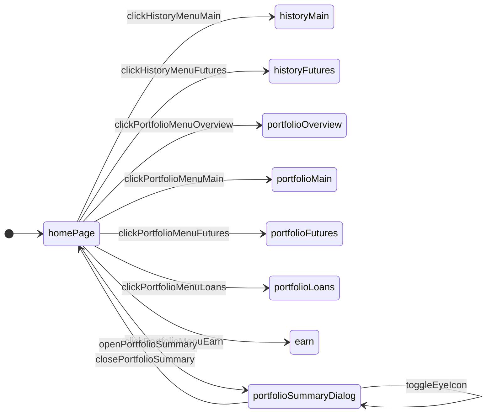
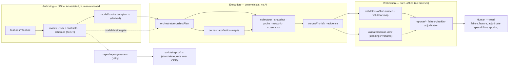
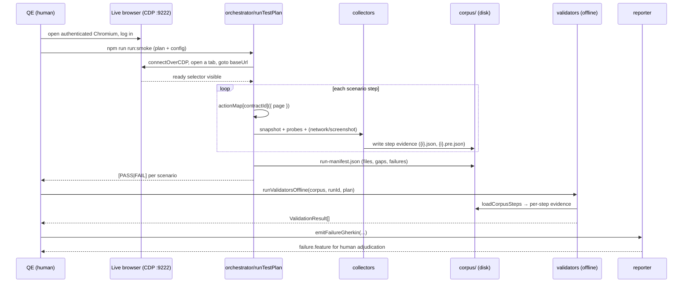

# Architecture — how Reactive Testing works

This document describes the system **as built** (epics 1–4, verified 2026-09-02).
Where the running code diverges from earlier planning documents, this file
reflects the code.

## The core idea

> "AD-*" references below are the numbered Architecture-Decision rules
> (AD-1 … AD-19) recorded in the project's internal planning spine
> (`_bmad-output/planning-artifacts/architecture/…/ARCHITECTURE-SPINE.md`).
> The prose here states each rule as the code implements it.

Everything flows through one pipeline with the **model at the center**:

```
Gherkin (input) → Model (SSOT) → Test Plan → Orchestrator → Collectors → Corpus → Validators → Reporter
```

The pipeline has two phases:

1. **Authoring** — offline and AI-assisted. Gherkin features are read by an AI
   agent and distilled into the executable **model**; the model is the single
   source of truth (AD-1). A named test plan is *derived* from the model.
2. **Execution & verification** — deterministic, **no AI in the loop**. The
   orchestrator runs a test plan against the live app, collectors record raw
   evidence into a corpus, and pure validators re-verify that evidence offline.

## The model is the SSOT

Three files in `model/` are the whole truth about the application under test:

| File | Holds |
|------|-------|
| `model/fsm.ts` | The state machine — states, transitions, initial state |
| `model/contracts.ts` | Behavioral declarations — pre/postconditions as typed machine predicates |
| `model/schemas.ts` | Every shared Zod schema — corpus data shapes and plan/artifact types |

Nothing else is truth: Gherkin is an *input* interface, test plans and repro
scripts are *derived*, and the corpus is *evidence of what the app did* — never
what it is (AD-2). `model/model-version.ts` hashes the three model files
(SHA-256); the generated plan embeds that hash, and the orchestrator refuses to
run against a stale plan (AD-17). A unit test (`model/model-version.test.ts`)
fails CI if a model edit forgets to regenerate the plan.

## The players

Each player owns one concern and communicates through typed interfaces.

- **`orchestrator/orchestrator.ts`** — `runTestPlan(plan, config)`. Pre-flights
  the plan (Zod parse, model-version match, state/contract/transition validity),
  then walks each scenario step: run the action from `orchestrator/action-map.ts`,
  wait for the settle selector, and trigger the collectors. Collector failures are
  isolated and recorded as gaps, never aborting the run (AD-16).
- **`orchestrator/action-map.ts`** — the canonical implementation of every
  contract (the concrete Playwright locators). Lives outside the model hash so
  editing a locator never bumps the model version.
- **`collectors/`** — four page collectors, passed the live `page` (AD-5):
  `snapshot` (serialized DOM), `probe` (targeted value extraction), `network`
  (HTTP events), `screenshot`. They write plain-data files into the corpus —
  never into TypeScript.
- **`validators/`** — pure functions, **corpus in → `ValidationResult` out**
  (AD-3, AD-14), no browser, no network. `corpus-loader.ts` rebuilds each step's
  evidence from a recorded run; `offline-runner.ts` composes loader + per-contract
  interpreter; `cross-view.ts` runs standing cross-view invariants.
- **`reporter/`** — consumes only `ValidationResult`s. `failure-gherkin.ts`
  renders failures into a reviewable `failure.feature`; `adjudication.ts` records
  the human's decision (spec-drift vs app-bug). Reporters write into the run's
  corpus folder.

Layer/import rules (the convention the code follows — see
[project-map.md](project-map.md) for the tree):
`collectors/`, `validators/`, and `reporter/` production modules import **no
other project layer** — only `model/` types/schemas (plus the libraries they
need: `playwright` types and `zod`); `repro/` imports `model/` plus
`orchestrator/action-map.ts`; only `orchestrator/` and `collectors/` touch a
live `Page` at runtime (the model itself only *types* `Page`). Test files may
import across layers to build corpus fixtures.

## The FSM — home page critical path

`model/fsm.ts` seeds 9 states and 10 transitions for the Kraken Pro read-only
critical path. The portfolio-summary dialog is a nested state of the home page.



## The pipeline



One recorded run funds N validations (AD-18): a later, newly written validator
or cross-view invariant runs against an **already recorded** corpus without a
fresh browser session.

## A run, end to end



## Honest inventory — what is *not* built (yet)

Several components from the original vision are intentionally absent or pending.
This testware is a proof-of-concept for the read-only Kraken Pro critical path.

- **No graph / CAP-4 features** — proposed-edge queries and standing reachability
  invariants are deferred to v1.1 (AD-11).
- **No CLI for verification/reporting** — `bin/` has exactly one entry point
  (`run-smoke.ts`). Offline validators and reporters are **library modules**
  driven by small `tsx` scripts (see [usage.md](usage.md)).
- **No xunit/CI output, no `reports/` directory** — reporters write Gherkin /
  JSON *into the run's corpus folder* instead.
- **No `test-plans/` directory** — the smoke plan is a single generated file
  `model/smoke.test-plan.ts`.
- **No headless smoke mode** — recording attaches to your authenticated browser
  over CDP; an anonymous headless launch exists only for local/CI tests.
- **Dialog predicates** (`dialog-open` / `dialog-closed`) and the cross-view
  **`portfolio-value` probe** are declared but not yet wired into a runner —
  tracked in `_bmad-output/implementation-artifacts/deferred-work.md`.
