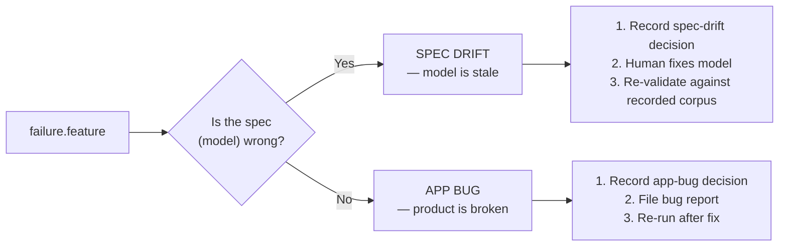

# Usage — the daily workflow

This is how you actually use the testware, in the order you'll do it.

## 0. Prerequisites

- Node ≥ 24 and npm (`npm ci` in the repo root).
- For **live recording only**: an authenticated Chromium started with a remote
  debugging port. Your browser is **never closed** by the tooling — it only
  connects, drives a tab, and disconnects.

  ```bash
  chromium --remote-debugging-port=9222 --user-data-dir=/tmp/kraken-profile
  ```

  Open **exactly one** window/context, log in to https://pro.kraken.com, and
  leave it open. The orchestrator requires exactly one authenticated context on
  the CDP endpoint.

## 1. Record a corpus (live)

```bash
npm run run:smoke
```

**Run-protocol precondition (Trade / Order Book):** before a smoke run that
includes the Order Book scenario, ensure the **Order Book** tab is present in
the Favorites bar on the Trade page. The "+"-add action is non-idempotent (it
creates the tab only when absent) and is excluded from plan steps. Add the tab
manually via the "+" button, then re-run. A scenario whose precondition is
violated fails fast with an actionable message — it never silently passes.

To re-run only selected scenarios, pass their exact ids after npm's `--` forwarding separator:

```bash
npm run run:smoke -- clicking-earn-navigates-to-the-standalone-earn-page pressing-escape-closes-the-portfolio-summary-dialog
```

The runner executes selected scenarios in plan order, deduplicates repeated ids, and
fails before connecting to CDP when an id is unknown (the error lists every valid id).
Without ids, the full plan runs as before. Exit-code semantics are unchanged.

What happens: the orchestrator attaches over CDP
(`http://127.0.0.1:9222`), opens a fresh tab, navigates to
`https://pro.kraken.com/app/home`, waits for the hero value, then walks the
**smoke plan** (`model/smoke.test-plan.ts` — 10 scenarios) driving each step via
the action map and collecting evidence after every step.

You see, per scenario:

```
[PASS] clicking-main-opens-the-history-page-for-the-main-account (…s)
[FAIL] <scenario-id> (…s) — <error, if any>
```

- Exit code `0` — at least one scenario passed. Final line: `Run complete:
  <passed>/<total> scenarios passed in …s`.
- Exit code `1` — **all** scenarios failed (inspect the per-scenario errors and
  the corpus), or **zero** scenarios ran — usually a model-version mismatch: the
  plan's embedded hash no longer matches `model/` (see §7). Note that a run
  where **some** scenarios fail still exits `0` — watch the per-scenario
  `[FAIL]` lines, not just the exit code.

The evidence lands under `corpus/<run-id>/` — a fresh run-id per recording.

## 2. Inspect a recorded run

Corpus layout (see [project-map.md](project-map.md) for the full file map):

```
corpus/                                  # kind dirs are siblings at corpus/ root
  <run-id>/run-manifest.json             # what the run wrote: files[], errors[], failures[], collectors[]
  snapshots/<run-id>/0.json, 0.pre.json, …
  probes/<run-id>/0.json, …
  network/<run-id>/0.json, …
  screenshots/<run-id>/0.png, …
```

A snapshot record is `{ stateId, url, snapshot, capturedAt }`; a probe result is
`{ name, value, capturedAt }` (e.g. `selected-view: "Ledger"`). The manifest
names every file the run wrote, plus any **collector gaps** (`errors`) and
**step failures** (`failures`) — a gap means a collector threw for one step and
its evidence is absent, never a crashed run.

> **Legacy corpora caveat:** the runs currently present in a local `corpus/`
> predate the per-step pre-snapshot layout, so re-validating *them* reports
> `missing snapshot evidence` for every precondition. A run recorded with the
> current orchestrator (§1) carries `{i}.pre.json` per step and re-validates
> cleanly — pinned by `orchestrator/offline-roundtrip.test.ts`.

## 3. Verify offline — no browser needed

Recording and verifying are separate. Once a run exists you can re-validate it
again and again, add new validators, and render reports — **with the browser
closed** (pure TypeScript over the corpus).

Validate the **latest recorded run** — resolved from the `@last-run` handoff
fan (exactly what §1 last wrote), falling back to the newest
`run-manifest.json` when the fan is absent:

```bash
npm run validate:smoke
```

Validate one **specific run** by passing its run id after npm's `--` forwarding
separator:

```bash
npm run validate:smoke -- 353dbf5a-ee9c-47a9-a982-3e373a6f9516
```

Validate only **selected contracts** by appending contract ids after the run id
(handy right after you added validators for one contract; repeated ids are
deduplicated):

```bash
npm run validate:smoke -- 353dbf5a-ee9c-47a9-a982-3e373a6f9516 filterHistoryByAsset
```

You see, per check (sample abridged):

```
[PASS] clickHistoryMenuMain
[FAIL] filterHistoryByAsset — [precondition] state-is "historyMain" but snapshot stateId is "homePage"
1/2 checks passed in 353dbf5a-ee9c-47a9-a982-3e373a6f9516
```

- Exit code `0` — every check passed.
- Exit code `1` — **any** check failed (each failure prints its details), a
  selected run yielded **no checks at all** (unreadable manifest or a plan with
  no steps — never a pass), the runId is unknown, no run is recorded yet, or
  the usage was wrong. An unknown contract id is also an error (it would
  silently validate nothing) — the message names every valid contract id.

The CLI is print-only: it reads `corpus/` and `model/`, never mutates the
corpus, and never touches a browser. Its scope is the smoke plan's **step
contracts** — one validator per recorded step. The standing cross-view
invariants are a separate runner (§5). `runValidatorsOffline` remains the
library API when you need the `ValidationResult`s programmatically — one per
step + validator: `{ contractId, passed, details?, corpusRefs }`.

> What to expect today: all declared predicates (`state-is`, `url-is`,
> `view-selected`, `dialog-open`, `dialog-closed`) are evaluatable, and the
> checks that assert them pass on a freshly recorded corpus (`toggleEyeIcon`
> asserts only its `dialog-open` precondition — its postconditions are
> intentionally empty). On a **legacy** corpus (see the §2 caveat) every
> precondition reports `missing snapshot evidence` — record a fresh run with
> §1 instead.

Derived reports (the `failure.feature` gherkin, adjudication records) are a
separate step over the same results — see §4.

### The committed sample fixture — validate and report with zero recording

`corpus/example/` is a committed, all-passing **mock** corpus (no real account
data, no screenshots/network in v1): a run manifest, 18 pre/post snapshots +
18 probe batches produced by the deterministic sample generator, plus its
`report.html`/`report.json`. It is the only git-tracked subtree under
`corpus/` — real recorded runs stay ignored.

Both offline CLIs accept `--corpus-dir <path>` (precedence: flag >
`CORPUS_DIR` env > the `corpus` default), so CI and readers target the
fixture explicitly without touching local recorded runs. The examples pass
the explicit runId (`example`) so a local `@last-run` fan can never redirect
them: without a runId, the newest recorded run is used — the committed
fixture only when no real run exists on the machine.

```bash
npm run validate:smoke -- example --corpus-dir corpus   # 18/18 checks passed in example
npm run report:smoke   -- example --corpus-dir corpus   # 14/14 scenarios + both reports in corpus/example/
```

Regenerate the fixture (and its reports) with the sample generator — two runs
are byte-identical, and the generator self-checks the freshly written fixture
through the real offline pipeline, exiting 1 with the failing check detail on
any violation (never a silent pass):

```bash
npm run generate:sample              # writes corpus/example + evidence + reports
npm run generate:sample -- /tmp/x    # optional corpus root (e.g. a CI temp dir)
```

## 4. Adjudicate a failure (spec drift vs app bug)

Every failing check is a fork — one of two things is true. Deciding which one
is the human's core responsibility.



### Render failure.feature

The failing checks render as a human-reviewable feature file — a derived
artifact, never the source of truth. Copy the run to a throwaway dir first, so
the report never pollutes the recorded corpus:

```ts
import { cpSync, mkdtempSync } from "node:fs";
import { tmpdir } from "node:os";
import { join } from "node:path";

import { emitFailureGherkin } from "./reporter/failure-gherkin.js";
import { smokeTestPlan } from "./model/smoke.test-plan.js";
import { runValidatorsOffline } from "./validators/offline-runner.js";

const runId = "<the run you validated in §3>";
const results = runValidatorsOffline("corpus", runId, smokeTestPlan);

// Work on a throwaway copy so reports never pollute the recorded run.
const scratch = mkdtempSync(join(tmpdir(), "reactive-verify-"));
cpSync(join("corpus", runId), join(scratch, runId), { recursive: true });

const written = emitFailureGherkin({ corpusDir: scratch, runId, plan: smokeTestPlan, results });
if (written.length) {
  console.log(`failures rendered → ${join(scratch, written[0])}`);
}
```

`emitFailureGherkin` writes one `Scenario: contract "…" was violated` per
failure — the input to the adjudication fork below.

### Spec drift — the model is stale

The application changed intentionally (new behaviour, renamed UI element, removed
feature), and the model has not caught up. The model — not the app — is wrong.

**What to do:**

1. Record a `spec-drift` decision with the `proposal` field (the model change
   the human approves).
2. Update the model — edit `model/fsm.ts`, `model/contracts.ts`, or
   `model/schemas.ts`.
3. Re-validate against the **same recorded corpus** (no fresh browser session
   needed — state reuse in action).
4. Regenerate the smoke plan.

### App bug — the product is broken

The model correctly describes what the app should do, but the app does not
match. The product — not the model — is wrong.

**What to do:**

1. Record an `app-bug` decision with a `bugReportRef` pointing to the issue.
2. File a bug report with the developer team.
3. The testware stays as-is — it correctly captures the expected behaviour.
   After the bug is fixed, re-run against a fresh corpus.

### Recording the decision

Build on the §3 results — copy the run to a throwaway dir first, so the derived
`adjudication.json` never pollutes the recorded corpus — and extend:

```ts
import { cpSync, mkdtempSync } from "node:fs";
import { tmpdir } from "node:os";
import { join } from "node:path";

import { emitAdjudicationRecord } from "./reporter/adjudication.js";
import { smokeTestPlan } from "./model/smoke.test-plan.js";
import { runValidatorsOffline } from "./validators/offline-runner.js";

const runId = "<the run you validated in §3>";
const results = runValidatorsOffline("corpus", runId, smokeTestPlan);

// Work on a throwaway copy so reports never pollute the recorded run.
const scratch = mkdtempSync(join(tmpdir(), "reactive-verify-"));
cpSync(join("corpus", runId), join(scratch, runId), { recursive: true });

// Spec drift — the model needs updating:
emitAdjudicationRecord({
  corpusDir: scratch,
  runId,
  plan: smokeTestPlan,
  results,
  decision: {
    decision: "spec-drift",
    proposal: "clickNotificationsMenu: postcondition stateId should be "notificationsPage" (was renamed from "notifications")",
  },
  approvedBy: "Jan Stavel",
  approvedAt: "2026-09-02T00:00:00.000Z",
});

// App bug — the application is wrong:
emitAdjudicationRecord({
  corpusDir: scratch,
  runId,
  plan: smokeTestPlan,
  results,
  decision: { decision: "app-bug", bugReportRef: "https://github.com/jstavel/reactive-testing/issues/1" },
  approvedBy: "Jan Stavel",
  approvedAt: "2026-09-02T00:00:00.000Z",
});
```

Either call writes `adjudication.json` into the run folder. The repo **never**
edits the model automatically — the decision is recorded as evidence, and the
human performs the model change separately.

## 5. Standing cross-view invariants

A fact shown on several surfaces is declared **once** in
`validators/cross-view.ts` (the registry) and checked across every surface that
shows it. The seeded invariant is
`current-portfolio-value-agrees-across-surfaces` — it reads a `portfolio-value`
probe on `homePage` and `portfolioSummaryDialog` and fails, naming the offending
view, when the surfaces disagree.

```ts
import { runCrossViewInvariants } from "./validators/cross-view.js";
import { smokeTestPlan } from "./model/smoke.test-plan.js";

const runId = "<the run you validated in §3>";
const results = runCrossViewInvariants("corpus", runId, smokeTestPlan); // read-only
for (const r of results) {
  console.log(`[${r.passed ? "PASS" : "FAIL"}] ${r.contractId}`, r.details ?? "");
}
```

> No runner configures the `portfolio-value` probe yet, so on recorded corpora
> this reports the surfaces as missing evidence (honest: it cannot confirm
> agreement). Wiring the probe into the runner is a tracked open item.

## 6. Standalone repro from the model

A reported bug path (FSM states + contracts) becomes a standalone Playwright
script that drives the path against the live app — no framework runtime, no
validators. The generator validates every step against the model + action map
and **throws a gap** (writes nothing) on an unmodeled path.

```ts
import { writeReproScript } from "./repro/repro-generator.js";

await writeReproScript({
  slug: "portfolio-summary-stuck-open",        // kebab-case names the file
  baseUrl: "https://pro.kraken.com/app/home",
  readySelector: '[data-testid="overview-portfolio-hero-value-text"]',
  settleSelector: '[aria-label="Side navigation"]',
  cdpUrl: "http://127.0.0.1:9222",
  steps: [
    { stateId: "homePage", contractId: "openPortfolioSummary" },
    { stateId: "portfolioSummaryDialog", contractId: "toggleEyeIcon" },
    { stateId: "portfolioSummaryDialog", contractId: "closePortfolioSummary" },
  ],
});
```

Run it with your authenticated browser on `:9222`:

```bash
npx tsx scripts/repro-portfolio-summary-stuck-open.ts
```

The script re-validates each step against the **current** model at run time (a
retired state/transition fails loudly instead of running a stale path), closes
only its own tab, and exits non-zero on failure.

## 7. The quality gates

```bash
npm run typecheck   # tsc --noEmit — types are the contract; must be clean
npm test            # vitest run — all offline (Playwright is mocked), ~2 s
```

The suite includes two cross-layer guards worth knowing:

- `model/model-version.test.ts` — fails if `model/smoke.test-plan.ts` embeds a
  stale model hash (i.e. a model edit that forgot to regenerate the plan).
- `orchestrator/offline-roundtrip.test.ts` — records a corpus through the real
  orchestrator and re-reads it through the real offline loader, proving the
  write→read contract.

## 8. Authoring — growing the model

The model is deliberately small (one read-only critical path). Growing it is an
**authoring** activity driven by AI-assisted BMad agents, following the same
pipeline that built the existing four epics.

### The authoring loop

```
Gherkin feature (business intent)
  → FSM state + contract (model/)
    → Action locator (action-map.ts)
      → Validator (if new predicate needed)
        → Regenerated smoke plan
```

### Step by step

1. **Write a Gherkin feature** in `features/` — captures the business intent,
   not the implementation.
2. **Add the FSM state** in `model/fsm.ts` — one entry in `states[]`, one
   entry in `transitions[]`.
3. **Declare the contract** in `model/contracts.ts` — typed pre/postconditions
   using the closed predicate vocabulary.
4. **Implement the action** in `orchestrator/action-map.ts` — the real
   Playwright locator. This is the only place locators live; changing a locator
   never bumps the model version.
5. **Add validators** (optional) — if the existing predicate interpreters
   (`state-is`, `url-is`, `view-selected`) do not cover what you need, write a
   pure function in `validators/` and register it in `validator-map.ts`.
6. **Regenerate the smoke plan** — `model/smoke.test-plan.ts` is derived from
   the model. Never hand-edit it. Regeneration is an AI-assisted step.

### Concrete example

See [docs/authoring-example.md](authoring-example.md) for a complete walkthrough
that adds a hypothetical Notifications screen — real code, every step.

### Quality gates after authoring

```bash
npm run typecheck          # types are the contract — must pass
npm test                   # all offline tests pass, including model-version guard
npm run run:smoke          # record a fresh corpus
# then verify offline (see §3)
```

The model-version guard test (`model/model-version.test.ts`) fails CI if you
edit a model file and forget to regenerate the plan.
